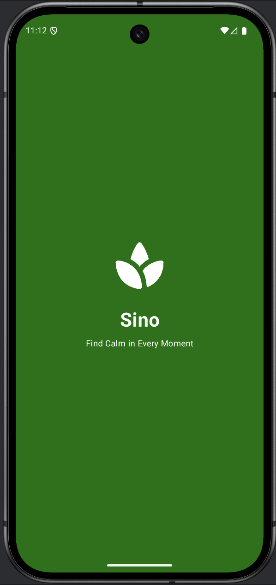
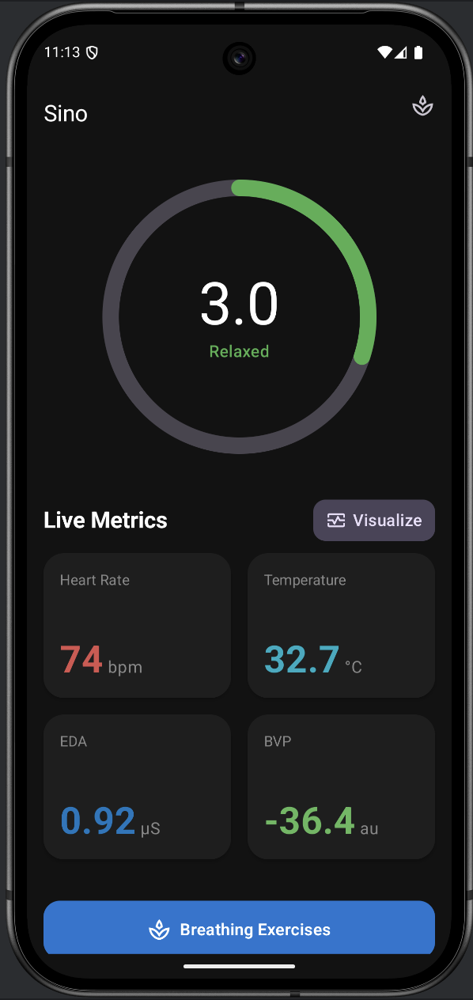
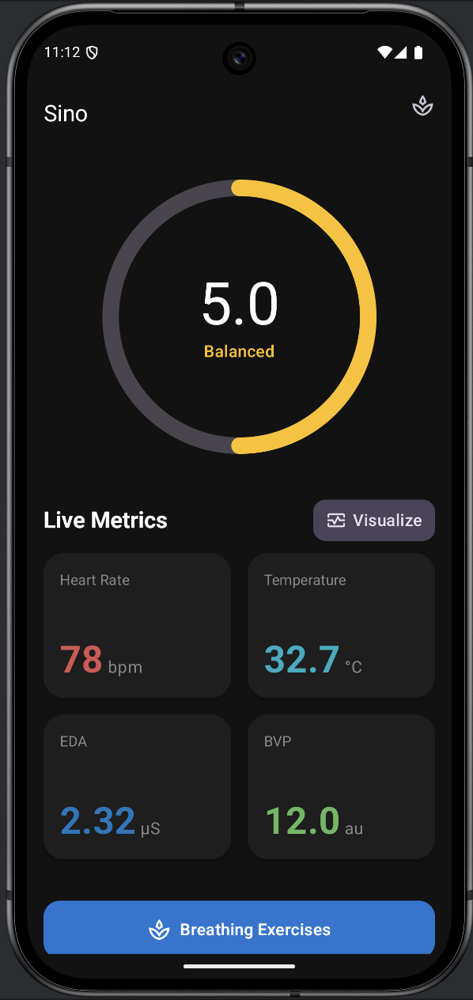
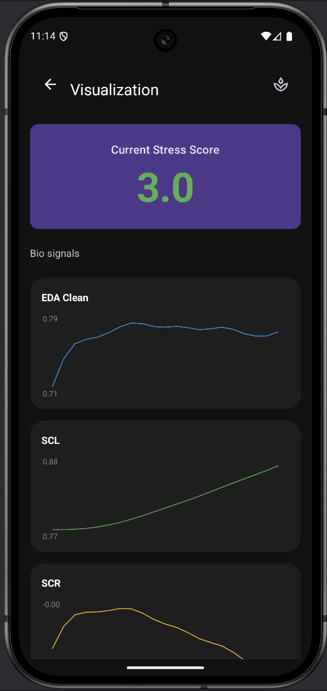
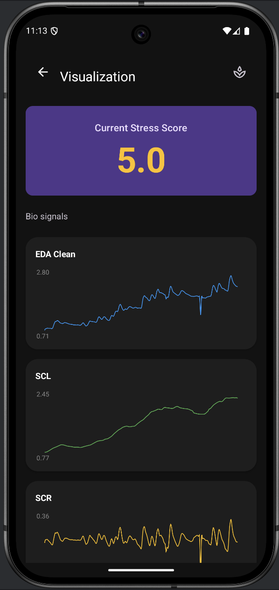
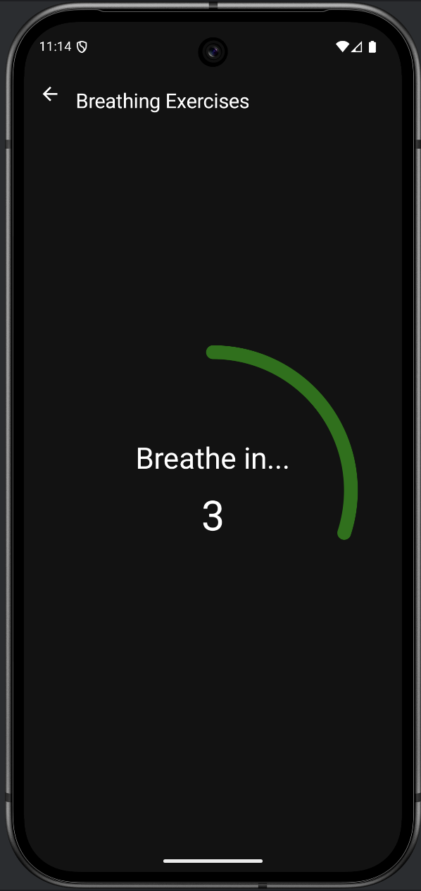
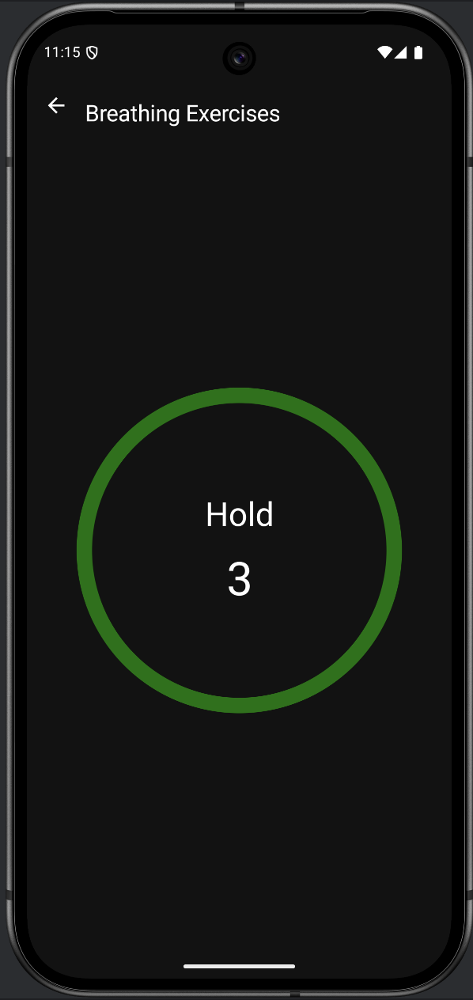
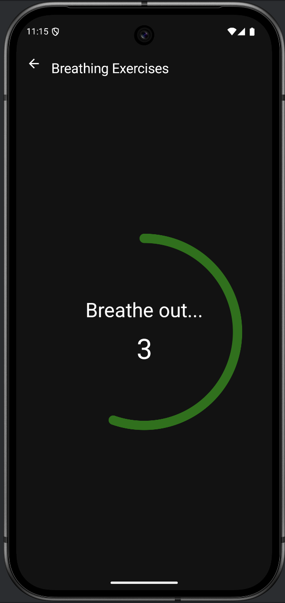

# Sino

Sino is an Android application designed to monitor physiological metrics and promote wellness through stress management and relaxation techniques.

## Screenshots
Splash screen
<p align="center">  </p>


Home Screen
<p align="center">
    
    
</p>


Visualize screen
<p align="center">
    
    
</p>


Breathing screen
<p align="center">
    
    
    
</p>


## Key Features

### 1. Real-Time Physiological Monitoring
Keep track of essential health metrics in real-time on the Home Screen:
*   **Heart Rate (BPM):** Monitors cardiac rhythm.
*   **Temperature (°C):** Tracks skin temperature.
*   **EDA (Electrodermal Activity):** Measures skin conductance to assess physiological arousal.
*   **BVP (Blood Volume Pulse):** Observes changes in blood volume.

### 2. Wellness & Stress Analysis
*   **Wellness Score:** Calculates a dynamic stress score based on physiological data to give you an immediate understanding of your current state.

### 3. Data Visualization
*   **Detailed Charts:** Navigate to the Visualization screen to view detailed graphs of your physiological data over time, helping you identify trends and patterns.

### 4. Breathing Exercises
*   **Guided Relaxation:** Access built-in breathing exercises designed to help reduce stress and regain focus.


## Installation
1. Clone the repository:
   ```
   git clone https://github.com/EKasuti/Sino.git
   ```
2. Open the project in Android Studio
3. Build and run the application on an emulator or physical device

## Contributors
- Kasuti Makau- [github](https://github.com/EKasuti)
- Jim Marigmen - [github](https://github.com/marigwell)
- Eric Zhou- [github](https://github.com/Ez-ethereal)

## License
This project is part of the Android Development course assignment at AIT.
